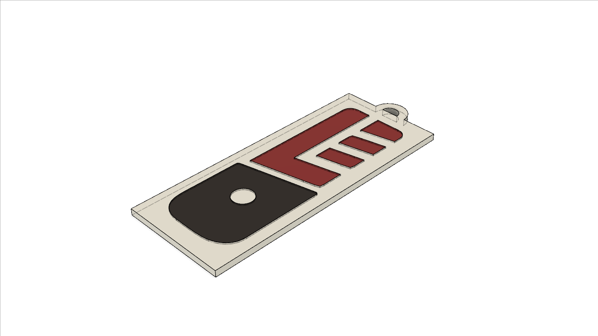

# Linux For Everyone Key Tag

This model contains multiple objects.

It is intended to be printed on a 3D printer that has only one extruder.

Load some white filament, and start printing `LFE_keychain_tag_0` - the small circle inside the handle.

Keep the model on the bed, change to a redish filament, then print parts 1 to 4 in one go.

Keep everything on the bed, change to a black filament, then print part 5.

Again, keep it all on the bed, change to white filament, and print part 6.

Make sure there is no leftover of the previous color when changing filament. Also, try to maintain the temperature of the bed (to prevent the pieces from moving) and the hot end (to be able to change the filament).

If you should use a brim, make sure it's either close enough or far enough from the pieces being printed to not collide with what is already on the bed. 

If you need me, I'm @frenchguych in the [linux4everyone telegram group](https://t.me/linux4everyone).

